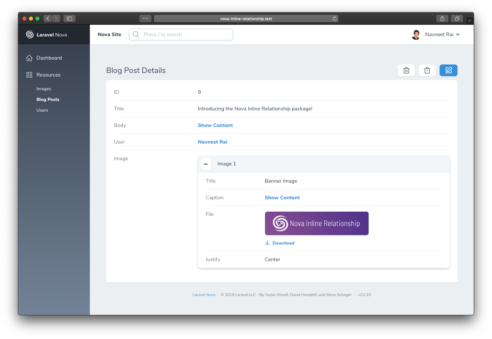

# Nova Inline Relationship

## Introduction
Nova Inline Relationship is meant to present a relationship based property as an inline property for a Laravel Nova Resource. You are welcome to request or contribute by opening an issue.


## Requirements

This Nova field requires Nova 2.0 or higher.

## Installation

You can install this package in a Laravel app that uses [Nova](https://nova.laravel.com) via composer:

```bash
composer require kirschbaum-development/nova-inline-relationship
```

## Usage

To use `NovaInlineRelationship` to your Model's resource all you need to do is to add an inline method to the regular syntax of your related Model's Resource. 

If we assume that an Employee Models has a one-to-one relationship with `EmployeeProfile` and one-to-many relationship with `EmployeeBill` model then the code will look like:
 
```php
namespace App\Nova;

class Employee extends Resource
{
    
    //...
    public function fields(Request $request)
    {
        return [
            //...

            HasOne::make('Profile', 'profile', EmployeeProfile::class)->inline(),
            
            HasMany::make('Bills', 'bills', EmployeeBill::class)->inline(),
        ];
    }
}
``` 
**_NOTE:_** You will need to add NovaResources for `EmployeeProfile` and `EmployeeBill` Model and all the field and rules will be fetch from it.

## Adding related models


After setup you can add new related models directly while creating a new base model. For example, If you have added an `EmployeeProfile` model as a related model for your `Employee` model, you can infact add information for a related `EmployeeProfile` model without going through an additional step. You can use the `Add new Profile` button to add a new  blank profile


## Adding multiple related models

If your relationship is a `one-to-many` relationship you can add multiple related models in a one go. 


## Viewing related models

Once you add your related models and visit your base model's detail view you can watch your related models in a collapsible view. So when you will watch an `Employee` model, you can watch `EmployeeProfile` models in a collapsible view.



## Updating related models 

When you will edit your base model, you will be able to add, update and remove your related model's in a view similar to create form.

For `one-to-many` relationships you can drag and drop related models to rearrange them in relation to your base model.


## Deleting related models

You can delete related models from the base model's update view by using the `delete button` at the top right corner.

## Supported fields

You can use any field you can add to your Nova resource with `Field::make` syntax. The following native Nova 2.0 fields are confirmed to work.

- Boolean Field
- Code Field
- Country Field
- Currency Field
- Date Field
- DateTime Field
- Markdown Field
- Number Field
- Password Field
- Place Field
- Select Field
- Text Field
- Textarea Field
- Timezone Field
- Trix Field
- Avatar Field
- Image Field
- File Field

## Changelog

Please see [CHANGELOG](CHANGELOG.md) for more information on what has changed recently.

## Contributing

Please see [CONTRIBUTING](CONTRIBUTING.md) for details.

## Security

If you discover any security related issues, please email navneet@kirschbaumdevelopment.com or nathan@kirschbaumdevelopment.com instead of using the issue tracker.

## Sponsorship

Development of this package is sponsored by Kirschbaum Development Group, a developer driven company focused on problem solving, team building, and community. Learn more [about us](https://kirschbaumdevelopment.com) or [join us](https://careers.kirschbaumdevelopment.com)!

## License

The MIT License (MIT). Please see [License File](LICENSE.md) for more information.
